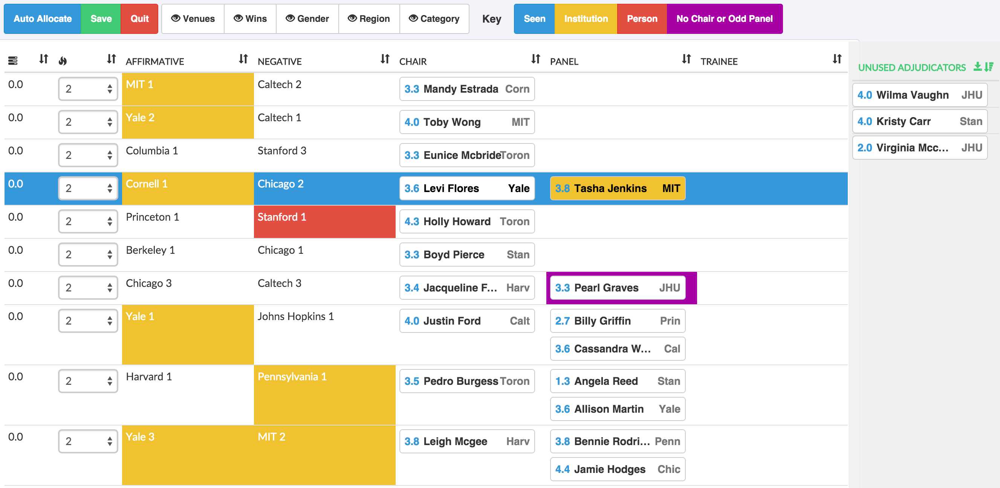

.. _adjudicator-allocation:

======================
Adjudicator Allocation
======================

The adjudicator allocation screen offers the ability to automatically generate an allocation and/or allow you to create an edit an allocation manually.

Creating an automatic allocation is as simple as hitting the **Auto Allocate** button. Before you do so however, you may want to change the 'importance' value of the debates — as defined in the column with the fire symbol. Debates with a higher importance value will receive a stronger panel.

Adjudicators can be dragged into position, or into the **Unused** section on the right. Dragging an adjudicator into the chair position, when an adjudicator is already there, will swap the pair.

Various kinds of information are displayed using different colour codes. When hovering over, or dragging an adjudicator:

- Their conflicts with other adjudicators and teams will show as red highlights
- Their institutional conflicts with other ajdudicators and teams will show as orange highlights
- Teams and adjudicators they have previously seen will highlight blue.

These colors are also used when adjudicators are in positions where any of the above apply. IE, in a panel where the team and adjudicator are conflicted, each will be highlighted red. In addition, panels with odd numbers of adjudicators, or that are missing a chair will be highlighted purple.

In addition, if you have importer gender, regional, and/or assigned multiple break categories to the teams, you can turn on the toggles that display this information in the draw (it will also display a color key).
