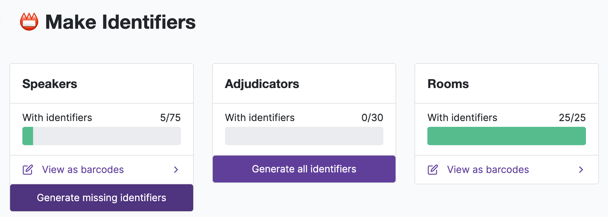
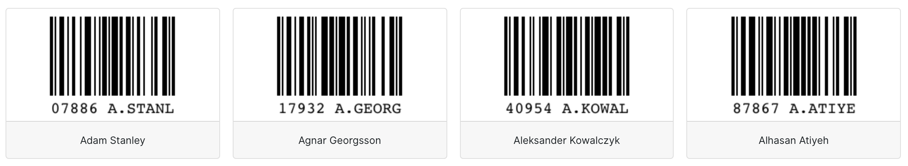
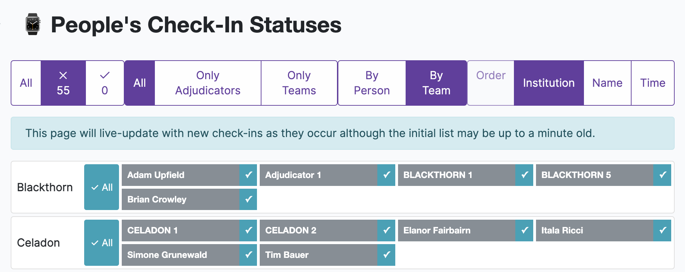

.. _check-ins:

=========
Check-Ins
=========

A 'Check-in' is a record of a speaker, adjudicator, venue, or ballot's status at a particular point in time. Typically these are used at large tournaments to reliably track who is or is not present for the first round of each day.

Check-ins serve a similar purpose to the :ref:`availability <availability>` system. However availabilities are tied to a particular round rather than to a particular time — they are generally used to record instances where you know ahead of time whether a person should or should not be included in a draw. In contrast, check-ins are useful for when you *don't* know ahead of time whether a person will be able to be put into the draw and so want to be able to confirm their presence with a high degree of confidence. That said the two systems interact — the standard availability pages allow you to easily set all adjudicators or teams who have checked-in as available for a given round.

Check-In Identifiers
====================

Check-ins are associated with a 'identifier' — a number that is unique to each speaker and adjudicator. To generate these numbers go to the *Identifiers* section under the Check-Ins menu. From here you generate identifiers for Speakers, Adjudicators, and Venues as needed. Note also that Identifiers can be manually added or edited in the *Edit Database* area if necessary.

Once this number has been generated it can be transformed into a barcode so that it can be easily included on tournament badges or otherwise printed and disbursed. On the same *Identifiers* page you can use the *View barcodes* option to open up a page that lists all the barcodes for the speakers, adjudicators, or venues.

.. note:: The identifiers for ballots are automatically generated when printing ballots.

Recording Check-Ins
===================

On the *Scanning* section of Check-ins you can record a particular check-in. This can be done in a few different ways:

1. You can type in the Identifier number into the box. Once five numbers have been identified it will automatically issue the check-in and clear the input field for the next number.

2. If you have purchased barcode scanners and configured them as USB keyboards they should then be compatible with this page: upon page load the cursor should be positioned in the input field, and any scanned barcodes should populate it with the specified number, issue the check-in, and then clear the box for the next scan.

    .. note:: Barcode scanners are probably cheaper than you think. A perfectly serviceable model should be around $20 USD or less although a cursory Google search might at first turn up models that are many times that amount. If you are a curious tab director, or are involved in a tournament with a little spare money, having just one or two around for critical tasks can be highly valuable.

3. If your device has a (web)cam you can use the Scan Using Camera button. Any barcodes put in front of the camera's video stream will be scanned into the form. A sound will play when a barcode has been identified — so be aware that turning sound on or using headphones can help identify when a scan has been made.

    .. image:: images/checkin_live.png

    .. note:: Camera scanning works on most modern browsers although it will only work with Safari 11 or higher (iOS 11+ and macOS 10.13+). Camera scanning may also not work when using a local-installation of Tabbycat in all browsers, *except* Firefox where it seems to. Depending on the quality of your camera barcodes that are less than 4cm wide may not be recognised — ideally barcodes should be at least 5cm if using this method as your main way of checking-in things.

4. The Check-in status page (described below) allows assistants and administrators to manually check-in particular people or entire institutions without needing to know their identifiers.

The Check-In 'Window'
=====================

Because Check-In events are not explicitly linked to rounds there is essentially a 'window' or time period in which a check-in is still considered valid. The time of this 'window' in hours can be set in *Setup* > *Configuration* > *Data Entry*.

At tournaments the run check-ins during the start of each day the check-in 'window' (i.e. the time before check-ins expire) you can leave this window setting at the default time (12 hours) which should give enough time to distinguish between the first check-ins of that day as compared to the last check-ins of the previous day. At tournaments where you want to run a check-in process at the start of every round you may want to set the time to around 2 hours or something much shorter.

Viewing Check-Ins
=================

On the *People Statuses* section of Check-ins you can view who has or has not been checked-in. This page will live-update with the latest check-ins so you should be able to leave it open to monitor income attendances.

The blue "tick" boxes allow you to manually check-in people and/or entire institutions (for *People*) or venues and/or venue groups (for *Venues*) , without the need to scan their identifiers. This style of check-in is designed for use an auditorium roll-call type situation where you might be running through a list of people to the room or identifying absences on a per-institution basis.

    .. note:: A public version of this check-in status page can be enabled under *Setup* > *Configuration* > *Public Features* which can be useful for allowing people to self-police check-ins and/or validate their check-in worked.

Check-Ins for Ballots
=====================

Ballots can be checked-in to quickly validate which ballots are physically present in the tab room. This can help more quickly identify ballots that are missing. Which ballots have or have not been checked-in will show up on the Results page. Ballots can be scanned using the standard 'Scan Identifiers' page.

Barcodes are automatically assigned and included to ballots when they are printed. Barcodes have no check-in window — any relevant check-in event counts regardless of how long ago it was.

Check-Ins for Venues
====================

Venues can be checked-in, but what a 'venue check-in' means is a bit more flexible. It might be used to validate which rooms are debate-ready at the start of a day (i.e. unlocked; has a desk) or it could be used during the rounds to record which rooms have returned their ballots.

Venues have a separate check-in window setting to that of people.

Venues have their own Status page (like people) and can be checked-in there manually. Like speakers and adjudicators their barcodes can also be printed off.
