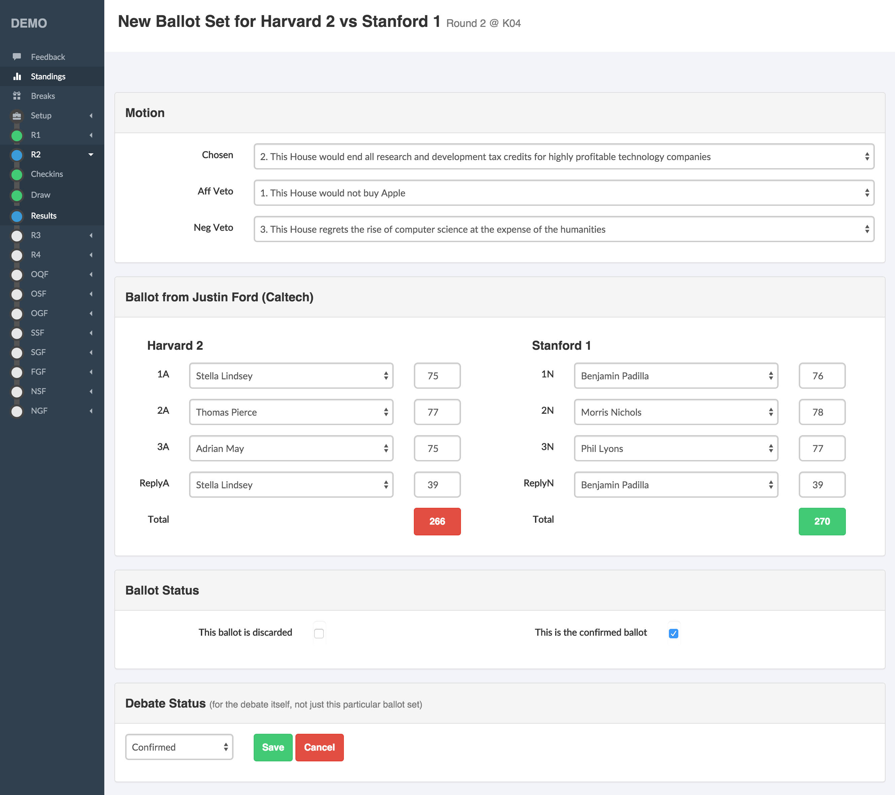
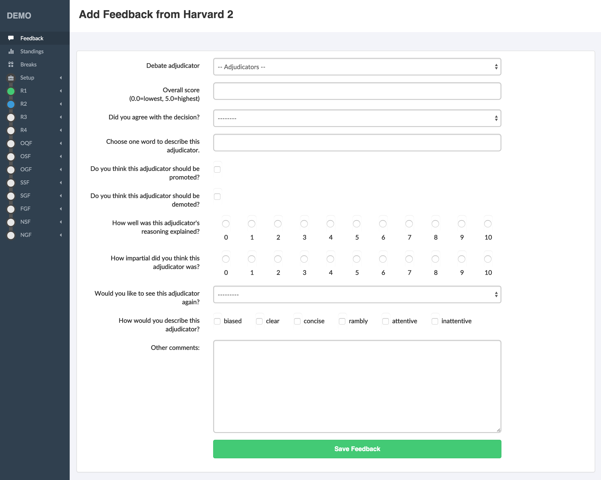

.. _data-entry:

=============================
Entering Ballots and Feedback
=============================

Ballot check-in
===============

For tournaments that require it, there is a "ballot check-in" page that can be used to record the arrival of ballots to the tab room. When there's a missing ballot, it can help establish whether the ballot never made it to the tab room, or whether it's probably floating around in the room forgotten. Also, it can help enforce early checks that panels return the correct number of ballots to the room.

To get to the ballot check-in, click the relevant round in the menu of the admin interface, and then click "Results" and then "Ballot Check-In". This requires superuser privileges.

There's no adverse effect from not using the ballot check-in. Data enterers will still be able to enter and confirmed ballots, even if not checked in.

.. tip::

  - Since the ballot check-in tends to require a dedicated computer or two, it can be worth creating a separate superuser account for ballot check-in, so that it doesn't appear on the action logs as being by a particular person.
  - Don't forget to provision a computer or two for this if you're planning to use it.
  - Ballot check-ins can be a bottleneck, so you might decide they're not worth using. Alternatively, you might have multiple computers for this purpose, or you might dedicate a tab room helper to driving the process (since this is probably faster than runners doing the typing in turn).

Ballot entry
============

Most tab rooms run some sort of check system to ensure data is entered accurately. In Tabbycat, this is built into the system, which also helps speed it up.

As a general principle, Tabbycat requires all ballots to be looked at by two people. The first person enters the data from the ballot, and the second person checks it. The second person isn't allowed to modify the data—they either confirm it or reject it, and if they reject it, then the whole process starts again. This is by design: to be confirmed, the *same* data must have been seen by at least two people.

.. caution:: The Tabbycat admin interface does **not** work like this. It's designed to be flexible, so allows you to edit, confirm or unconfirm any ballot at any time. For this reason, you should **not** use the Tabbycat admin interface for general data entry. If a tab director or adjudication core member will be entering data, they should have a separate account for this purpose.

.. tip::

  - Don't forget to check the totals against the ballot—they're a useful integrity check too.
  - Don't forget to check the winner against the ballot! If the adjudicator gets it wrong, it's worth asking to clarify.
  - It can be helpful to think about the room layout to maximize efficiency.
  - Some tab rooms like to assign some to data entry and some to verification. This isn't really necessary, since Tabbycat doesn't let the same person enter and verify the same ballot. (This is one of many reasons why every person should have their own account.)

Speakers who speak twice
========================

Note that the ballot entry interface will not let you have a single person speak in more than one position. If a speaker is 'iron manning' the best approach is to go into the **Edit Data** section (under **Setup** in the admin area's menu) and add a new speaker to that team for this purpose. Once in the Edit Data section, go to **Participants** then **Teams** then the **Speakers** tab. Typically it is best practice to indicate in their name they are delivering a second speech (ie "Jane Smith Repeat") and to assign them the position that received the lower of the two scores.

.. tip:: There is a option under **Standings** in the **Config** section that specifies the number of debates that you can miss before you will not show on the tab. By default it is set to 1, but if need be this can be increased to hide these 'fake' speakers from the final speaker tab.

Feedback entry
==============

Feedback doesn't have the same verification process as ballots. Feedback that is entered by the tab room is assumed to be confirmed. If feedback is entered multiple times, all copies are retained but only the last one "counts" (is considered confirmed).

Online ballot submissions
=========================

.. todo:: We haven't written this documentation yet.

Online feedback submissions
===========================

.. todo:: We haven't written this documentation yet.
