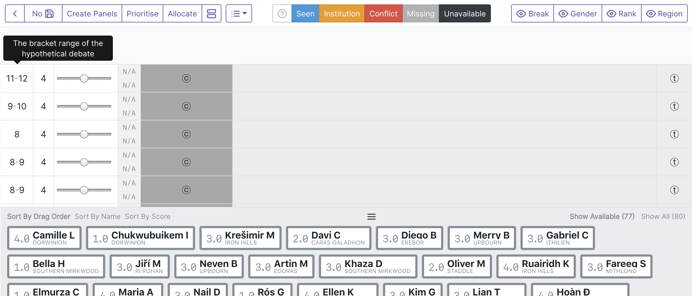
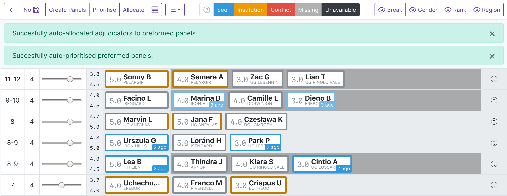
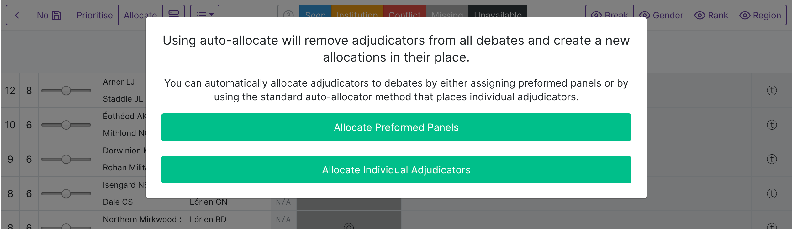
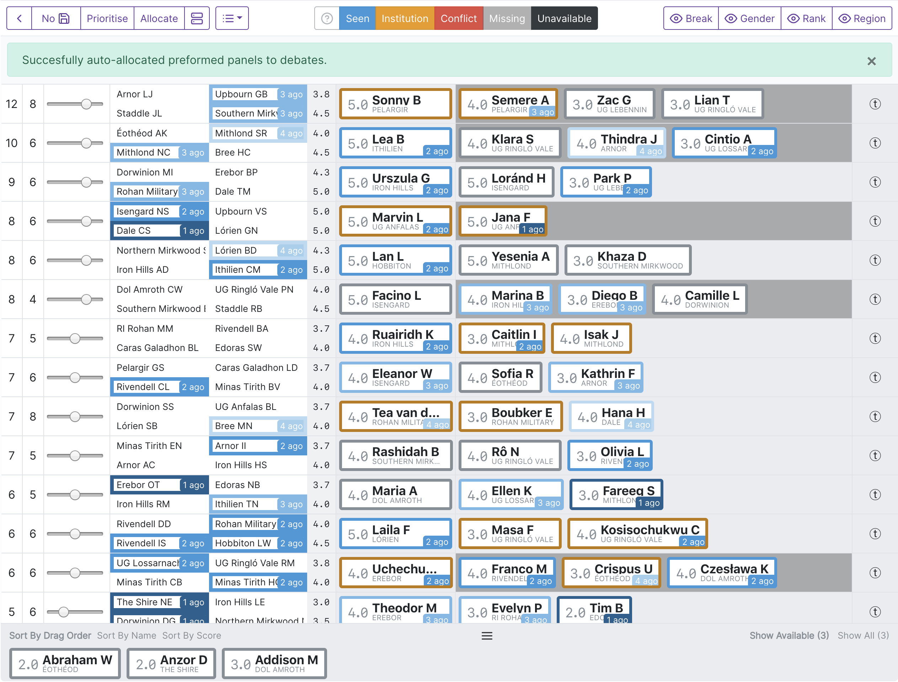

.. _preformed-panels:

================
Preformed Panels
================

Preformed panels, also known as a 'shadow draw', allow adjudicator panels to be created *before* a round has been drawn and then applied once its draw is ready. This means that panel formation can be done during periods outside the normal time pressure of finalising a draw for release. This can save a lot of time at large tournaments, or at tournaments where the adjudication core wants to carefully control the specific combination of adjudicators within panels.

Tabbycat's implementation of preformed panels is more powerful, but less simple, than many others. The chief difference is that our workflow does not simply transpose a linear set of preformed panels atop a draw. Instead we employ Tabbycat's existing allocation tools, primarily the notion of a debate's *priority*, to allow for a non-linear matching of preformed panels that avoids adjudicator conflicts and better adapts to a given draw — particularly when the most important debates do not strictly follow the highest debate brackets.

The central concept is that each preformed panel has a priority value. When applying preformed panels to a draw, the allocator ties to best match the priority value of each preformed panel to the priority of each actual debate. This is similar to how Tabbycat's normal auto-allocator matches the strength of each panel (as measured by adjudicators' ratings) to the priority of each debate.

Step 1: Create preformed panels
===============================

You can find the preformed panels section either

- under the **Setup** menu (for all rounds), or
- on the **Draw** page (for the current and next round).

Initially, the preformed panels page will have no panels. Click the **Create Panels** button in the top left to make some. The panels it creates are based upon a projection of that round's general results using the results of the previous round. As a result, each preformed panel will have a *bracket range*, the lowest and highest brackets that debate might be in, and a *liveness range*, the maximum number of teams that could be live in that room.

.. note:: Like the normal adjudicator allocation interface, the preformed panel interfaces will indicate when an adjudicator has not been marked as available. If using preformed panels, you may want to set adjudicator availability earlier than you would otherwise.

.. note:: Liveness in the anticipated draw only pertains to the open category (the first break category that is marked as a "general" category). It's not possible to meaningfully predict where teams open-dead but live in other categories will end up.

Step 2: Assign priorities to preformed panels
=============================================

By default the priority slider for all preformed panels is in the neutral position. You can use the "Prioritise" button in the top left to assign priority values automatically, based upon their brackets or liveness. Before or after this step you can alter the priorities as usual — even after you have allocated adjudicators.

It's important to remember to assign a range of priorities to the panels. Without distinct priority values, the application of your preformed panels to the actual draw will be essentially random. If allocating priorities manually, it is a good idea to keep a relatively even distribution of priorities — use the range!

.. note:: In Round 1, each debate has a liveness and bracket of 0. If you are using preformed panels in this instance you may need to manually-differentiate their priorities.

Step 3: Allocate adjudicators to preformed panels
=================================================

Now that your panels have a priority, you can begin allocating adjudicators. You can do this manually, but do note that the normal auto-allocator for adjudicators also works in this context (the "Allocate" button). Even if you want to tweak your panels extensively, the auto-allocator can provide a good first-pass collection of panels, because it will give stronger adjudicators to the panels that you have marked as important.

The created panels all auto-save, so you can leave the page and return to pick up where you left. Like the main allocation interface, changes should appear 'live' across different computers and the sharding system is available to divide up each person's view of the draw.

Step 4: Generate the draw
=========================

Proceed with the creation of the draw as usual. Open up the normal adjudicator allocation page for that round.

Step 5: Assign priorities to debates
====================================

When allocating preformed panels, the priority levels are what connects the preformed panels to the actual debates. It is thus crucial that you assign priorities to the debates in the actual draw using automatic prioritisation or the manual sliders. Because the automatic prioritiser does not employ the highest priority value, it is worth having a look at the draw and seeing if any debates justify this before proceeding.

Step 6: Allocate preformed panels to debates
============================================

To allocate preformed panels to your debates, click the normal "Allocate" button and then select the *Preformed Panels* option.

This will then allocate the preformed panels to debates.

You can the edit the allocation as normal. If needed, you can redo the allocation of the preformed panels at any point.

How does the allocator work?
============================

Roughly speaking, the allocator tries to match panel priorities to debate priorities, while avoiding conflicts. It'll mostly try to swap panels within priority levels in order to avoid conflicts. If there aren't exactly as many panels at each priority level as there are debates, it'll do its best to match what it can.

More formally, it treats the allocation of preformed panels to debates as an `assignment problem <https://en.wikipedia.org/wiki/Assignment_problem>`_, with a cost of assigning each panel :math:`p` to each debate :math:`d` given by

.. math::

  C(p,d) = w_\mathrm{mism} [\mathrm{importance}(p) - \mathrm{importance(d)}]^2 + w_\mathrm{conf} \, \mathrm{conflicts}(p,d) + w_\mathrm{hist} \, \mathrm{history}(p,d)

where

- :math:`w_\mathrm{mism}` is the "Importance mismatch penalty" in the "Draw rules" settings,
- :math:`w_\mathrm{hist}` is the "Adjudicator conflict penalty" in the "Draw rules" settings,
- :math:`w_\mathrm{conf}` is the "Adjudicator history penalty" in the "Draw rules" settings,
- :math:`\mathrm{importance}(p)` is the importance of panel :math:`p`,
- :math:`\mathrm{importance}(d)` is the importance of debate :math:`d`,
- :math:`\mathrm{conflicts}(p,d)` is the number of adjudicator-team conflicts between panel :math:`p` and debate :math:`d`, and
- :math:`\mathrm{history}(p,d)` is the number of adjudicators and teams who have seen each other between panel :math:`p` and debate :math:`d`.

It then uses the `Hungarian algorithm <https://en.wikipedia.org/wiki/Hungarian_algorithm>`_ to find the assignment of panels to debates that minimizes the total cost of the pairings.
