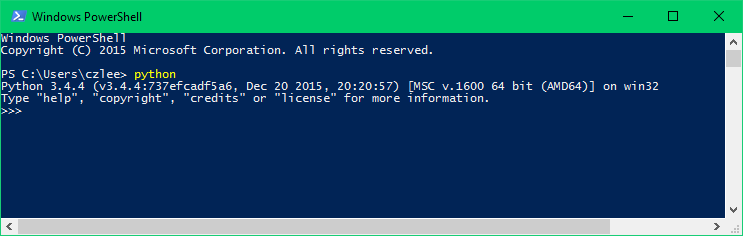

.. _install-windows:

=============================
Installing Locally on Windows
=============================

.. admonition:: Notice on status of these instructions
  :class: note

  The developers of Tabbycat have **stopped actively maintaining** these instructions. For Windows 10 users, we now recommend :ref:`Linux on Windows (WSL) <install-wsl>` for local installations. We're keeping these instructions up in case they're useful for anyone who might need them, but please be aware that they might not work smoothly.

  If you encounter any problems, please seek help in our `Facebook group <https://www.facebook.com/groups/tabbycat.debate/>`_. We're lucky to have a fantastic community of Tabbycat users who are often kind enough to share their experiences with fellow users, and someone there might be able to help.

.. admonition:: Is this the best installation method for you?
  :class: attention

  In most cases, we recommend doing an :ref:`internet-based installation on Heroku <install-heroku>` instead. If you decide to do a local installation, be sure to read our page on :ref:`local installations <install-local>` to help you understand what's going on, particularly this section: :ref:`install-decision`

  If you just want to quickly set up a copy of Tabbycat to run locally on Windows, consider :ref:`installing using Docker<install-docker>`, which is a shorter process than the one below.

  If you have Windows 10 and any experience with Linux, we recommend installing it on :ref:`Linux on Windows (WSL) <install-wsl>` instead, which is much easier than the process below.

Requisite technical background
==============================

You need to be familiar with command-line interfaces to get through this comfortably. While a background in the specific tools Tabbycat uses (Python, PostgreSQL, *etc.*) will make things easier, it's not necessary: we'll talk you through the rest. You just need to be prepared to bear with us. It'll take a while the first time, but it gets easier after that.

In these instructions, we'll use **Windows PowerShell**, a command-line interface that comes with every installation of Windows (since XP). The easiest way to find it (on Windows 7 and later) is to search for it in your Start Menu. Every line in the instructions that begins with ``>`` is a command that you need to run in PowerShell, but without the ``>``: that sign is a convention used in instructions to make it clear that it is a command you need to run.

.. admonition:: Advanced users
  :class: tip

  If you wish to use an SQL engine other that PostgreSQL, most of Tabbycat should work, but a few features rely on SQL functions that aren't supported by all engines. To configure Tabbycat to use a different engine, set the ``DATABASES`` `Django setting <https://docs.djangoproject.com/en/2.2/ref/settings/#databases>`_ accordingly.

1. Install dependencies
=======================

First, you need to install all of the software on which Tabbycat depends, if you don't already have it installed.

.. _install-python-windows:

1(a). Python
------------
  *Python is a popular programming language, and the language in which the core of Tabbycat is coded.*

Download and install the latest version of Python from the `Python website <https://www.python.org/downloads/>`_.
In the installer, check the box to add Python to your PATH (see box below).

.. hint:: Which file should I download?

    - Regardless of if you have 64-bit or 32-bit Windows, choose the "Windows x86 executable installer".

.. attention:: **Please take note:** Just after you open the installer,
  **check the "Add Python 3.x to PATH" box**:

  .. image:: images/python-windows-path.png

To check that Python is installed correctly, open Windows PowerShell, type ``python`` and press Enter. It should look something like this. If you installed the 32-bit version, it will say ``32 bit`` instead of ``64 bit``.

(To exit Python, type ``exit()`` then press Enter.)

.. note:: **If you already have Python**, great! Some things to double-check:

  - You must have at least Python 3.6. (Python 2 is not supported.)
  - Your installation path must not have any spaces in it.
  - If that doesn't work, note that the following must be part of your ``PATH`` environment variable: ``C:\Python38;C:\Python38\Scripts`` (or as appropriate for your Python version and installation directory). Follow `the instructions here <https://www.java.com/en/download/help/path.xml>`_ to add this to your path.

.. _install-windows-postgresql:

1(b). PostgreSQL
----------------
  *PostgreSQL is a database management system.*

Go to the `PostgreSQL downloads page <http://www.postgresql.org/download/windows/>`_, then follow the link through to EnterpriseDB to download and install the latest version of PostgreSQL.

.. tip:: Once PostgreSQL is installed, the PostgreSQL service will run on your computer whenever you are using it. You might prefer to configure it so that it only runs when you want to run Tabbycat. To do this, open "Services" in your Control Panel on Windows, find the PostgreSQL service, and change its startup type to "Manual". This will tell it not to start whenever you log in. Then, if you want to run the server (so you can use Tabbycat), you can do so from "Services" by selecting the PostgreSQL service and clicking "Start the service".

1(c). Git
---------
  *Git is a version control system.*

We won't use Git directly, but Node.js (which we install in the next step)
requires Git to work. So, install the latest version for Windows from the
`Git website <https://git-scm.com/downloads>`_.

.. admonition:: Advanced users
  :class: tip

  If you already have `GitHub Desktop <https://desktop.github.com/>`_ installed,
  you might think that this would be good enough. Unfortunately, it's
  not---GitHub Desktop installs a portable version of Git. Node.js, on the other
  hand, requires the ``git`` to be in the ``PATH``, so it can call it directly.
  The easiest (but not only) way to do this is just to install Git from the link
  above.

1(d). Node.js/NPM
-----------------
  *Node.js is a JavaScript runtime.*

Download and run the node.js 8 Installer (.msi) for either `x64 versions  <https://nodejs.org/dist/v12.18.1/node-v12.18.1-x64.msi>`_ of Windows or `x86 versions <https://nodejs.org/dist/v12.18.1/node-v12.18.1-x86.msi>`_.

2. Get the source code
======================

a. `Go to the page for our latest release <https://github.com/TabbycatDebate/tabbycat/releases/latest>`_.
b. Download the zip file.
c. Extract all files in it to a folder of your choice.

.. admonition:: Advanced users
  :class: tip

  If you've used Git before, you might prefer to clone `our GitHub repository`_ instead. Don't forget to check out the |vrelease| tag or the master branch.

  Even better, you might like to fork the repository first, to give yourself a little more freedom to make code changes on the fly (and potentially :ref:`contribute <contributing>` them to the project).

.. _install-windows-database:

3. Set up a new database
========================

.. hint:: You can skip steps 2 and 3 if this is not your first installation. Every Tabbycat installation requires its own database, but they can use the same login role if you like.

a. Open the **pgAdmin** tool, which you installed as part of installing PostgreSQL. In the object browser on the left, double-click the server marked "(localhost:5432)". Log in using the password you set during installation.

b. Right-click Login Roles, and click "New Login Role…"

  .. image:: images/pgadmin-new-login-role-menu.png

c. Fill in the New Login Role box as follows (everything not listed below can be left as-is):

   - In the **Properties** tab, in **Role Name**, choose a user account name. (If you don't know what to pick, we suggest "tabbycat".)
   - In the **Definition** tab, choose a **Password** and type it in **Password (again)**.

   Then click OK. (Remember this user name and password, you'll need it later.)

d. Right-click Databases, and click "New Database…"

  .. image:: images/pgadmin-new-database-menu.png

e. Fill in the New Database box as follows (everything not listed below can be left as-is):

   - In the **Properties** tab, in **Name**, choose a database name (with no spaces in it).
   - In the **Properties** tab, in **Owner**, type the name of the login role you just created.

   Then click OK. (Remember the database name, you'll need it later.)

4. Install Tabbycat
===================

Almost there!

a. Open a Windows PowerShell. Navigate to the folder where you cloned/extracted Tabbycat. For example, if you installed it in ``C:\Users\myusername\Documents\GitHub\tabbycat``, then run::

    > Set-Location C:\Users\myusername\Documents\GitHub\tabbycat

b. Make a copy of **settings\\local.example** and rename it to **settings\\local.py**. Open your new **local.py** file. Find this part, and fill in the blanks (the empty quotation marks) as indicated:

  .. code:: python

     DATABASES = {
         'default': {
             'ENGINE'  : 'django.db.backends.postgresql',
             'NAME'    : '',  # put your PostgreSQL database's name in here
             'USER'    : '',  # put your PostgreSQL login role's user name in here
             'PASSWORD': '',  # put your PostgreSQL login role's password in here
             'HOST':     'localhost',
             'PORT':     '5432',
         }
     }

  Optionally, replace the value in this line in the same file with your own time zone, as defined in the `IANA time zone database <https://en.wikipedia.org/wiki/List_of_tz_database_time_zones#List>`_ (*e.g.*, ``Pacific/Auckland``, ``America/Mexico_City``, ``Asia/Kuala_Lumpur``)::

    TIME_ZONE = 'Australia/Melbourne'

c. Start a new virtual environment. We suggest the name `venv`, though it can be any name you like::

    > python -m venv venv

d. Run the `Activate.ps1` script. This puts you "into" the virtual environment::

    > .\venv\Scripts\Activate.ps1

  .. attention:: If you get an error message saying that the script isn't digitally signed, open a PowerShell with administrator privileges by right-clicking PowerShell in the Start meny and clicking "Run as administrator". Then run this command::

      > Set-ExecutionPolicy RemoteSigned

    Read the warning message, then type ``y`` to confirm. By default, the execution policy on Windows is ``Restricted``, which does not permit scripts like ``activate`` to be run. Changing it to ``RemoteSigned`` relaxes it to allow local scripts to be run without checking the signature.

e. Install Tabbycat's requirements.

  If you installed **32-bit Python**::

    > python -m pip install --upgrade pip
    > pip install -r .\config\requirements_core.txt
    > npm install

  .. hint:: You might be wondering: I thought I already installed the requirements. Why am I installing more? And the answer is: Before, you were installing the requirements to create a Python virtual environment for Tabbycat to live in. Now, you're *in* the virtual environment, and you're installing everything required for *Tabbycat* to operate.

f. Initialize the database and create a user account for yourself::

    > cd tabbycat
    > dj migrate
    > npm run windows-build
    > dj collectstatic
    > dj createsuperuser

g. Start Tabbycat!

  ::

    > dj runserver

  It should show something like this::

    Starting development server on http://127.0.0.1:8000

h. Open your browser and go to the URL printed above. (In the above example, it's http://127.0.0.1:8000/). It should look something like this:

  .. image:: images/tabbycat-bare-windows.png

  If it does, great! You've successfully installed Tabbycat.

Naturally, your database is currently empty, so proceed to :ref:`importing initial data <importing-initial-data>`.

Starting up an existing Tabbycat instance
=========================================

To start your Tabbycat instance up again next time you use your computer, open a PowerShell and::

    > Set-Location C:\Users\myusername\Documents\GitHub\tabbycat # or wherever your installation is
    > .\venv\Scripts\activate
    > cd tabbycat
    > dj runserver
