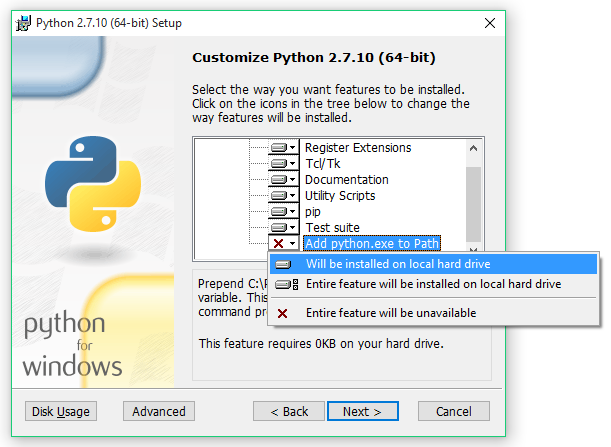
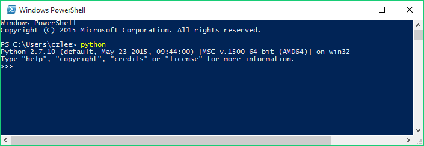

.. _install-windows:

=============================
Installing locally on Windows
=============================

Before you start, be sure to read our general information on :ref:`local installations <install-local>` to help you understand what's going on.

Requisite technical background
=======================================================================

You need to be familiar with command-line interfaces to get through this comfortably. While a background in the specific tools (Python, *etc.*) we use will make things easier for you, it's not necessary: we'll talk you through the rest. You just need to be prepared to bear with us. It'll take a while the first time, but it gets easier after that.

In these instructions, we'll use **Windows PowerShell**, a command-line interface that comes with every installation of Windows (since XP). The easiest way to find it (on Windows 7 and later) is to search for it in your Start Menu. Every line in the instructions that begins with ``>`` is a command that you need to run in PowerShell, but without the ``>``: that sign is a convention used in instructions to make it clear that it is a command you need to run.

.. note:: Advanced users: Tabbycat is a Django project, so can be installed in any manner that Django projects can normally be installed. For example, if you prefer some SQL system other than PostgreSQL, you can use it so long as it's Django-compatible. Just be aware that we might not have tried it.

1. Install dependencies
=======================================================================

First, you need to install all of the software on which Tabbycat depends, if you don't already have it installed.

1(a). Python
-------------------------------------------------------------------------
  *Python is a popular programming language, and the language in which the core of Tabbycat is coded.*

`Download and install Python 3.4 <https://www.python.org/downloads/release/python-344/>`_. Take note of the following:

- Which link should I click?
    - If you have 32-bit Windows, choose the "Windows x86 MSI installer".
    - If you have 64-bit Windows (and not an Itanium processor), you can choose either of the two MSI installers, but it's better to choose the "Windows x86-64 MSI installer".
    - If you're not sure whether you have 32-bit or 64-bit Windows, consult "About your PC" or "System Properties" in your Start Menu.
- Your installation path must not have spaces in it. The default install directory is ``C:\Python34``; we recommend that you keep it there.
- **Important! When you get to the Customize screen, change "Add python.exe to Path" to "Will be installed on local hard drive"**, as shown below:



To check that Python is installed correctly, open Windows PowerShell, type ``python`` and press Enter. It should look something like this. If you installed the 32-bit version, it will say ``32 bit`` instead of ``64 bit``.



(To exit Python, type ``exit()`` then press Enter.)

**If you already have Python**, great! There are some things you should double-check about your installation:

- You must have Python 3.4. No other versions of Python are supported.
- Your installation directory must not have any spaces in it. The default install directory is ``C:\Python34``, so yours is probably there. But it's not allowed to be in, for example, ``C:\Program Files\Python34``.
- The following must be part of your `PATH` environment variable: ``C:\Python34;C:\Python34\Scripts``.

1(b). PostgreSQL
-------------------------------------------------------------------------
  *PostgreSQL is a database management system.*

[**Follow this link** to the PostgreSQL downloads page](http://www.postgresql.org/download/windows/), then follow the link through to EnterpriseDB to download and install the latest version of PostgreSQL.

> *Note: Once PostgreSQL is installed, the PostgreSQL service will run on your computer whenever you are using it. You might prefer to configure it so that it only runs when you want to run Tabbycat. To do this, open "Services" in your Control Panel on Windows, find the PostgreSQL service, and change its startup type to "Manual". This will tell it not to start whenever you log in. Then, if you want to run the server (so you can use Tabbycat), you can do so from "Services" by selecting the PostgreSQL service and clicking "Start the service".*

2. Get the source code
=======================================================================

There are two ways to get the source code: by using Git, or by downloading a release zip file. If you can, we encourage you to use Git. It'll be easier to keep up to date with Tabbycat and to deploy to a Heroku installation later. However, Git can be confusing for first-timers, so if you just want to get going, the zip file will do fine.

Option 1: Clone the Git repository
-------------------------------------------------------------------------

>*Git is a revision control system widely used in software development.*

1. If you don't already have Git, [**follow this link**, and install GitHub for Windows](https://help.github.com/articles/set-up-git/).
2. [Click here to **clone the repository** in your GitHub desktop client](github-windows://openRepo/https://github.com/czlee/tabbycat). That link will ask to open an external application, namely GitHub.

> *Note: The link above is the same one as the  link on the right-hand side of the <a href="https://github.com/czlee/tabbycat/">repository home page</a>.*

> *Advanced users: Cloning from the command line works too. Also, if you have a GitHub account, you might like to fork the repository first, to give yourself a little more freedom.*

Option 2: Download a release package
-------------------------------------------------------------------------

1. [**Follow this link** to our release packages page](https://github.com/czlee/tabbycat/releases).
2. Download the latest zip file (or tar.gz if you prefer).
3. Extract all files in it to a folder of your choice.

3. Set up a new database
=======================================================================

1. Open the **pgAdmin** tool, which you installed as part of installing PostgreSQL. In the object browser on the left, double-click the server marked "(localhost:5432)". Log in using the password you set during installation.

   > *You can skip steps 2 and 3 if this is not your first installation. Every Tabbycat installation requires its own database, but they can use the same login role if you like.*

2. Right-click Login Roles, and click "New Login Role…"

   

3. Fill in the New Login Role box as follows (everything not listed below can be left as-is):

   - In the **Properties** tab, in **Role Name**, choose a user account name.<br />(If you really don't know what to pick, use "tabbycat".)
   - In the **Definition** tab, choose a **Password** and type it in **Password (again)**.

   Then click OK. (Remember this user name and password, you'll need it later.)

4. Right-click Databases, and click "New Database…"

   

5. Fill in the New Database box as follows (everything not listed below can be left as-is):
   - In the **Properties** tab, in **Name**, choose a database name (with no spaces in it).
   - In the **Properties** tab, in **Owner**, type the name of the login role you just created.

   Then click OK. (Remember the database name, you'll need it later.)

4. Install Tabbycat
=======================================================================

Almost there!

1. Open a Windows PowerShell (no administrative privileges required). Navigate to the folder where you cloned/extracted Tabbycat. For example, if you installed it in `C:\Users\myusername\Documents\GitHub\tabbycat`, then run

    > Set-Location C:\Users\myusername\Documents\GitHub\tabbycat

2. Make a copy of **local_settings.example** and rename it to **local_settings.py**. (You can do this in File Explorer.) Open your new local_settings.py. Find this part, and fill in the blanks (the empty quotation marks) as indicated:

    DATABASES = {
       'default': {
           'ENGINE'  : 'django.db.backends.postgresql_psycopg2',
           'NAME'    : '',  # put your PostgreSQL database's name in here
           'USER'    : '',  # put your PostgreSQL login role's user name in here
           'PASSWORD': '',  # put your PostgreSQL login role's password in here
           'HOST':     'localhost',
           'PORT':     '5432',
       }
    }

3. Start a new virtual environment. We suggest the name `venv`, though it can be any name you like.

    > virtualenv venv

4. Run the `activate` script. This puts you "into" the virtual environment.

    > .\venv\Scripts\activate

5. Install Tabbycat's requirements.

   If you installed **32-bit Python**:

    > pip install --upgrade pip
    > easy_install http://www.stickpeople.com/projects/python/win-psycopg/2.6.1/psycopg2-2.6.1.win32-py2.7-pg9.4.4-release.exe
    > pip install -r requirements_common.txt

   If you installed **64-bit Python**:

    > pip install --upgrade pip
    > easy_install http://www.stickpeople.com/projects/python/win-psycopg/2.6.1/psycopg2-2.6.1.win-amd64-py2.7-pg9.4.4-release.exe
    > pip install -r requirements_common.txt

   > *Note: Because you're on Windows, the <code>psycopg2</code> package won't work. There is a good Windows version called <a href="http://www.stickpeople.com/projects/python/win-psycopg/">win-psycopg</a>, which we'll use instead. The purpose of the second line above is to install it, and therefore stop the third line—which installs everything—from trying to install the Unix version.*
   > *You might be wondering: I thought I already installed the requirements. Why am I installing more? And the answer is: Before, you were installing the requirements to create a Python virtual environment for Tabbycat to live in. Now, you're <em>in</em> the virtual environment, and you're installing everything required for <em>Tabbycat</em> to operate.*

6. Initialize the database and create a user account for yourself.

    ```
    > dj makemigrations debate
    > dj migrate
    > dj createsuperuser
    ```

7. Start Tabbycat!

    ```
    > dj runserver
    ```

   It should show something like this:

    ```
    Performing system checks...

    System check identified no issues (0 silenced).
    August 17, 2015 - 22:24:43
    Django version 1.8.2, using settings 'settings'
    Starting development server at http://127.0.0.1:8000/
    Quit the server with CTRL-BREAK.
    ```

8. Open your browser and go to the URL printed above. (In the above example, it's http://127.0.0.1:8000/.) It should look something like this:

   

   If it does, great! You've successfully installed Tabbycat.

Naturally, your database is currently empty, so proceed to **[[importing initial data]]**.

Starting up an existing Tabbycat instance
=======================================================================

To start your Tabbycat instance up again next time you use your computer, open a PowerShell and:

    ``` powershell
    > Set-Location C:\Users\myusername\Documents\GitHub\tabbycat # or wherever your installation is
    > .\venv\Scripts\activate
    > dj runserver
    ```