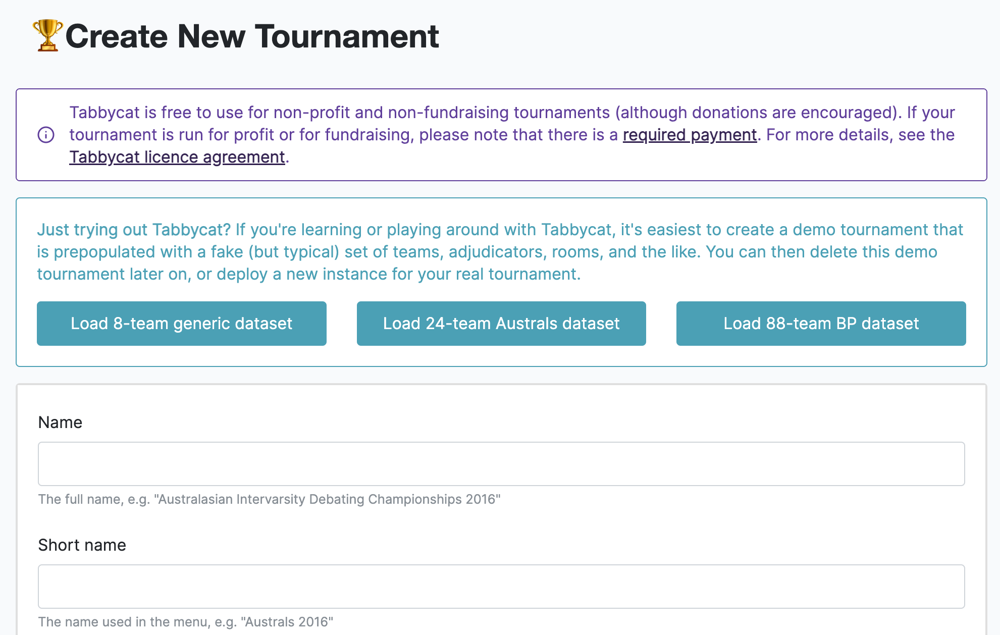
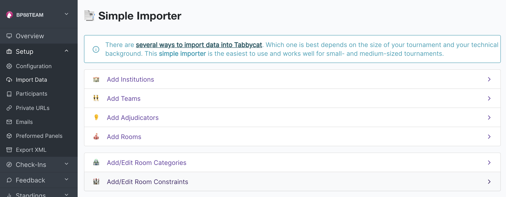
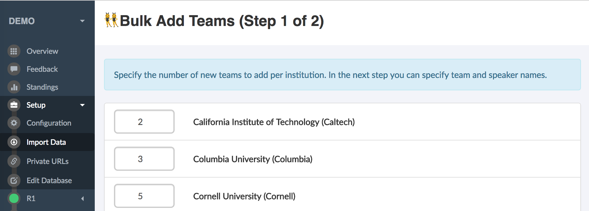
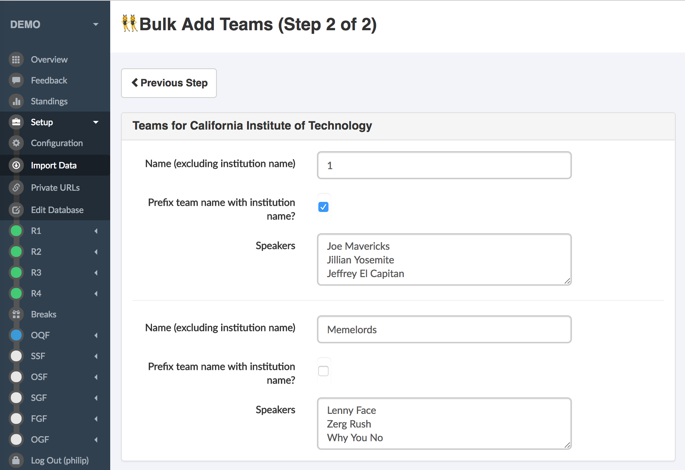

.. _importing-initial-data:

======================
Importing Initial Data
======================

Once you've got Tabbycat installed, the next step is to import data for the tournament: that is, import details of teams, speakers, adjudicators and rounds. There are a few ways to do this, each with their advantages and disadvantages.

To help you decide which to choose, here's a summary:

+----------------------+-------------------+--------------------+----------------------+
|        Method        |      Best for     |      Drawcard      |       Drawback       |
+======================+===================+====================+======================+
| **Demonstration      | Trying out        | Loads sample data  | Not for use with     |
| data**               | Tabbycat          | in one click       | real tournaments     |
|                      |                   |                    |                      |
+----------------------+-------------------+--------------------+----------------------+
| **Simple             | Small and         | Easy to use        | Only deals with      |
| importer**           | medium-sized      |                    | basic data           |
|                      | tournaments       |                    |                      |
+----------------------+-------------------+--------------------+----------------------+
| **Edit               | Adding data not   | Can handle all     | Adding large amounts |
| database**           | handled by the    | types of           | of data is time      |
|                      | simple importer   | information        | consuming            |
|                      | or editing        |                    |                      |
|                      | existing data     |                    |                      |
+----------------------+-------------------+--------------------+----------------------+
| ``importtournament`` | Large tournaments | Easier to repeat,  | Requires basic       |
| **command**          |                   | can handle most    | knowledge of how to  |
|                      |                   | formats of         | use a command line   |
|                      |                   | information        | interface            |
+----------------------+-------------------+--------------------+----------------------+
| **Developing your    | Large tournaments | Easier to repeat,  | Requires background  |
| own importer**       | with custom needs | will take          | in Python and        |
|                      |                   | information in     | and learning about   |
|                      |                   | whatever format it | the importer classes |
|                      |                   | is already in      |                      |
+----------------------+-------------------+--------------------+----------------------+
| **API**              | Tournaments with  | Less manual        | Requires programming |
|                      | external          | intervention       | knowledge or use of  |
|                      | registration      |                    | an existing external |
|                      | systems           |                    | application          |
+----------------------+-------------------+--------------------+----------------------+

Demonstration data
==================
If you're just learning or experimenting with Tabbycat, there are two demonstration datasets available, each with a sample set of teams, adjudicators, *etc.*, so that you can immediately start running rounds. Just be aware that these probably won't relate to anyone at your real-life tournament.

To load a demonstration dataset, click **New Tournament** link on the home page (once logged in as admin). You'll see a page titled "Create New Tournament". Scroll to the bottom of this page and click on one of the links at the bottom.

Simple importer
===============
The simple importer is the easiest way to get a tournament going, and we recommend it for small- and medium-sized tournaments. It allows you to add institutions, teams, adjudicators, venues, venue categories and venue constraints. (If you need to add anything else, use the :ref:`Edit Database area <import-edit-database>` instead.)

To get started, create a new tournament using the **New Tournament** link on the home page (once logged in as admin). It'll ask you for a few basic pieces of information.

Then, once you're in your tournament, click **Setup** in the left-hand menu, then **Import Data**, to open the simple importer.

You first need to add institutions. Once institutions are added, you can then add teams and adjudicators in the relevant sections. Each of these is a two-step process:

- For **institutions** and **venues**, it will first ask you to copy-paste a list of names and properties in a comma-separated table format.  The second step is to confirm individual fiels.
- For **teams** and **adjudicators**, it will first ask you how many teams/adjudicators to add for each institution (or who lack an institutional affiliation). The second step is to fill in their details, for example, names.

.. image:: images/add-institutions.png

Finally, if you would like to use venue categories and/or :ref:`venue constraints <venue-constraints>`, you can do so using the two last sections of the simple importer.

.. note:: If copying and pasting from a spreadsheet, an easy way to make a comma-separated table is to save a spreadsheet with the relevant information as a \*.csv file, then open this file in a plain text editor (such as Notepad or TextEdit), and copying it from there.

.. _import-edit-database:

Editing the database
====================
Sometimes, the simple importer just isn't enough---whether because you need more customization than the simple importer handles (*e.g.* adjudicator feedback questions), or because some participants changed their details after you imported the inital data. In this case, the easiest thing to do is to edit the database via the Django administrative interface (under Setup > Edit Database).

The general pattern goes like this: Go to **Setup > Edit Database**, find the type of object you wish to add/change, and click "Add" or "Change". Then, fill in what you need to and save the object.

.. caution:: The Edit Database area is very powerful, and naturally if you mess things up, you can insert potentially catastrophic inconsistencies into the database. For participant information this is hard to do, but it's worth keeping in mind.

.. _importtournament-command:

The ``importtournament`` command on local installations
=======================================================

We've written a management command called ``importtournament`` to help automate the tournament set-up. The script, however, is neither foolproof nor comprehensive, so you might find you need to modify things slightly if your tournament structure is different from ours. Be prepared to try this a few times to get it to work. Nonetheless, this is probably the fastest way to set up a tournament.

1. Copy and rename the ``data/demo`` folder
2. See the CSV files in the new folder, and add/replace the data as per your tournament. Note that the institutions (*i.e.* first column) in the ``speakers.csv`` and ``adjudicators.csv`` files must match the institutions in the second column of the ``institutions.csv`` file. And that all CSV files must end with a blank line.
3. Use this command, replacing ``YOUR_DATA_DIR`` with your new folder's name. (Square brackets indicate optional arguments; if you use them, omit the square brackets. All of them relate to the name of your tournament.)

::

  $ ./manage.py importtournament YOUR_DATA_DIR [--slug SLUG] [--short-name SHORT_NAME] [--name FULL_NAME]

This script has a number of options. They're worth taking a look at before you run the script. For details, see::

  $ ./manage.py importtournament --help

4. Assuming the command completes successfully without errors, you should double check the data in the Django interface, as described above in :ref:`import-edit-database`. In particular you should check that the *Rounds* have the correct draw types and that silent rounds have been marked correctly.

``importtournament`` on Heroku installs
========================================

Instructions for using the ``importtournament`` command on Heroku installations are in steps 4 and 5 of :ref:`install-heroku`. The recommended procedure is first to import the tournament into a local installation, :ref:`as described above <importtournament-command>`, and then to push the local database to Heroku using the ``heroku pg:push`` command.

Developing your own importer
============================

If our suggested file formats cause you headaches, it might be easier to write your own importer. We have a generic importer framework that should make this easier, so for some tournaments it might (very conceivably) be faster to write your own importer to conform to your data, than it is to make your data conform to our importer. You need a background in Python in order to do this. For more details, see :ref:`tournament-data-importers`.

Application Programming Interface (API)
=======================================

Participants can be imported in Tabbycat through the :ref:`API <api>`, using authenticated endpoints making ``POST`` requests to the relevant endpoints. There may be tournament registration software which interfaces with Tabbycat, or you may have to program one yourself, in any language.
