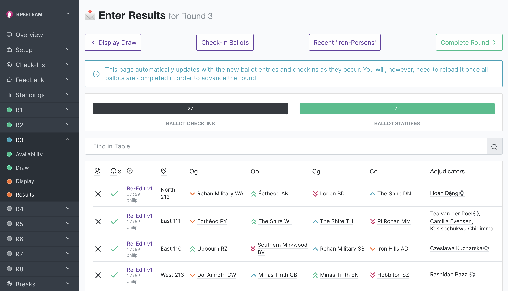

.. _running-a-tournament:

====================
Running a Tournament
====================

Once you've finished the steps in :ref:`starting-a-tournament`, you're ready to go! This page outlines what you would do for each round during the tournament. After the tournament, proceed to :ref:`finishing-a-tournament`.

The menu is on the side of the page. In the admin interface, tournament-wide pages (feedback, standings, and break) are at the top, while round-specific pages (check-ins, draw, and results) are in dropdown's organised by each round;s abbreviation.

The workflow for each round is:

#. :ref:`Generate the draw <generating-the-draw>`
#. :ref:`Release the draw <releasing-the-draw>`
#. Have the debates
#. :ref:`Enter results <data-entry>`
#. :ref:`Advance to the next round <advancing-round>`

.. _generating-the-draw:

Generating the draw
===================

This is all done from an admin interface (*i.e.*, by the tab director or adjudication core member):

1. **Set availability.** For each round, you need to set the venue, team and adjudicator availability. To do this, click the round in the menu, then click **Check-Ins**. Here you can then go to the availability pages for venue, teams, and adjudicators, or check in everything at once. If going to the team/venues/adjudicators page, you would edit the availability and click **Save changes** then return to the overview page.

  .. image:: images/checkins-page.png

2. **Generate the draw.** Hit the **Generate Draw** button on the Check-Ins page. Follow the instructions to generate the draw.

  .. image:: images/draft-draw.png

  .. note:: Tabbycat will show you a draft draw before you confirm it. In the draft draw, it'll show you details so that you can understand how it came up with the draw, pointing out pull-ups and conflict swaps and the like. This is for you to double-check. While there are some basic tests on the draw algorithm, it never hurts to sanity-check it again.

    If you *do* find something wrong with a draft draw, you can edit the match-ups, but please also let us know what the problem was! You can find our contact details in the :ref:`authors` section.

3. After the draft draw has been confirmed, it will show the confirmed draw page.

  .. image:: images/draw-without-adjs.png

4. Click **Edit Adjudicators** and allocate adjudicators. It's a good idea to save periodically, in case something goes wrong or you want to revert. See  :ref:`adjudicator allocation <adjudicator-allocation>` for more details about this process.

  .. image:: ../features/images/adj-allocation.png

.. _releasing-the-draw:

Releasing the draw
==================

Once you're happy with your adjudicator allocation, you're ready to start the round.

1. **Release to general assembly.** From the (confirmed) *Draw* page, go to **Show by Venue** or **Show by Team** (whichever you prefer). Then put it up on the projector. There are automatic scroll buttons and buttons for changing text sizing.

  .. image:: images/draw-by-venue.png

  .. caution:: The main *Draw* page shows a ranked draw, *i.e.* teams can infer their position on the tab from the version on the admin interface. Unless you want to spare teams the fun of backtabbing, you probably don't want them to see this. So you should turn the projector off before you log in to Tabbycat on the projected computer, and only turn it on once you have the *Show by Venue* or *Show by Team* draw up.

  .. tip:: To avoid the site from being overloaded by anxious refreshers, we recommend not releasing the draw to the public until after it's been seen by general assembly.

2. **Release to public.** If you're using the public draw function, use the **Release to Public** button to publicly display the draw page.

3. **Release motions to general assembly.** Release the motions however you would normally release the motions. (Tabbycat won't do this for you.)

4. **Enter and release motions.** Enter the motion(s) for each round using the **Edit Motions** link, then use the **Release Motions to Public** button to publicly display them.

  .. note:: Currently, it's mandatory to enter motions into the system. (You don't have to release them, just enter them.) We eventually intend to make it optional, but this is low priority. If you'd like it to be optional, please get in touch with us and we'll accord it higher priority.

5. Entering results. See :ref:`data-entry` for more details about this process.

6. Enter debate results and feedback as they come in (and/or allow online entry of results and feedback).

7. Both results and feedback entered in the tab room or online need to be confirmed before the results are counted. To confirm a debate ballot and the debate as a whole, the confirmed checkbox under *Ballot Status* should be ticket in addition to the *Debate Status* being set to Confirmed.

You can track data entry from the **Overview** page in an admin account (get there by clicking the tournament's name in the menu).

.. warning:: For major tournaments, we don't recommend entering any data from an admin's account. This is because the admin interface (intentionally) does not enforce the data confirmation procedure.

.. _advancing-round:

Advancing to the next round
===========================

Once you've got all the results entered and confirmed, you're ready to progress to the next round. This can be done by going to the **Results** area, and then using the **Advance to Next Round** button.

.. warning:: When you advance to the next round, if you've enabled public results, the results for the current round (which is now the previous round) will be release to the public **unless** the round is marked as "silent" in the database. So if you're careful about when results should be released, don't change the current round until you're ready to release those results.

.. note:: There is a design assumption that you will always want to release results for non-silent rounds before you start working on the draw for the next round. If this isn't true for you, please get in touch with us so that we know. The workaround is to make all rounds silent, then unsilent them when you're ready to release results.
